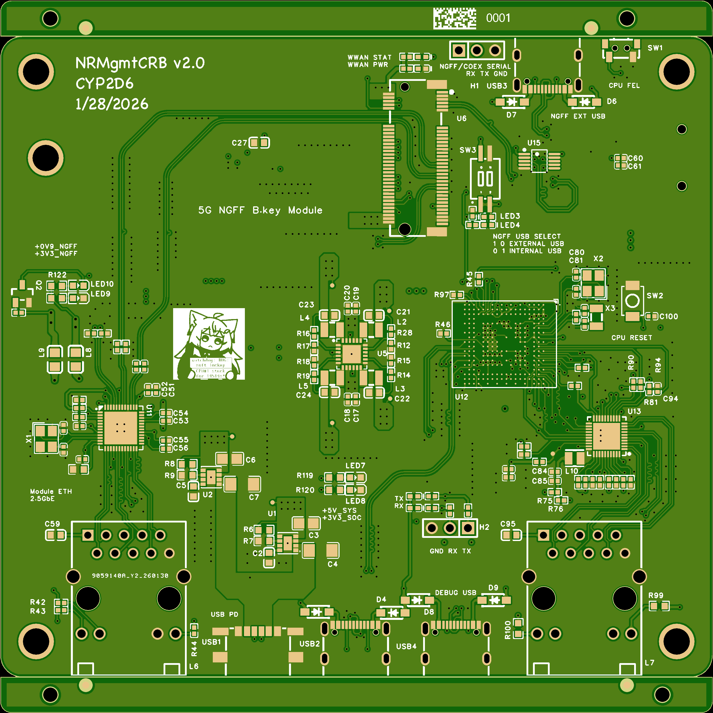
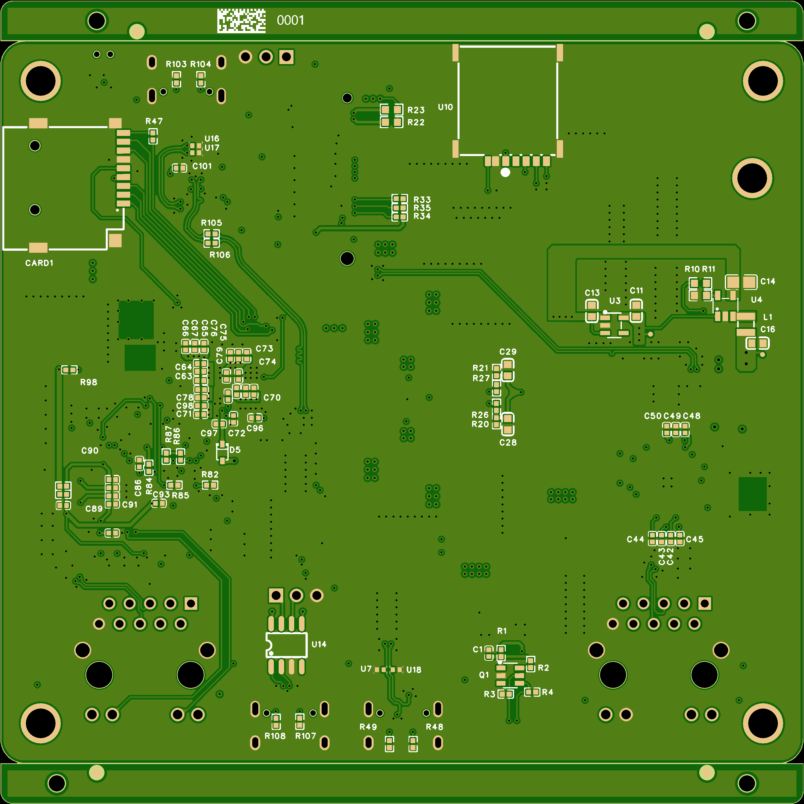
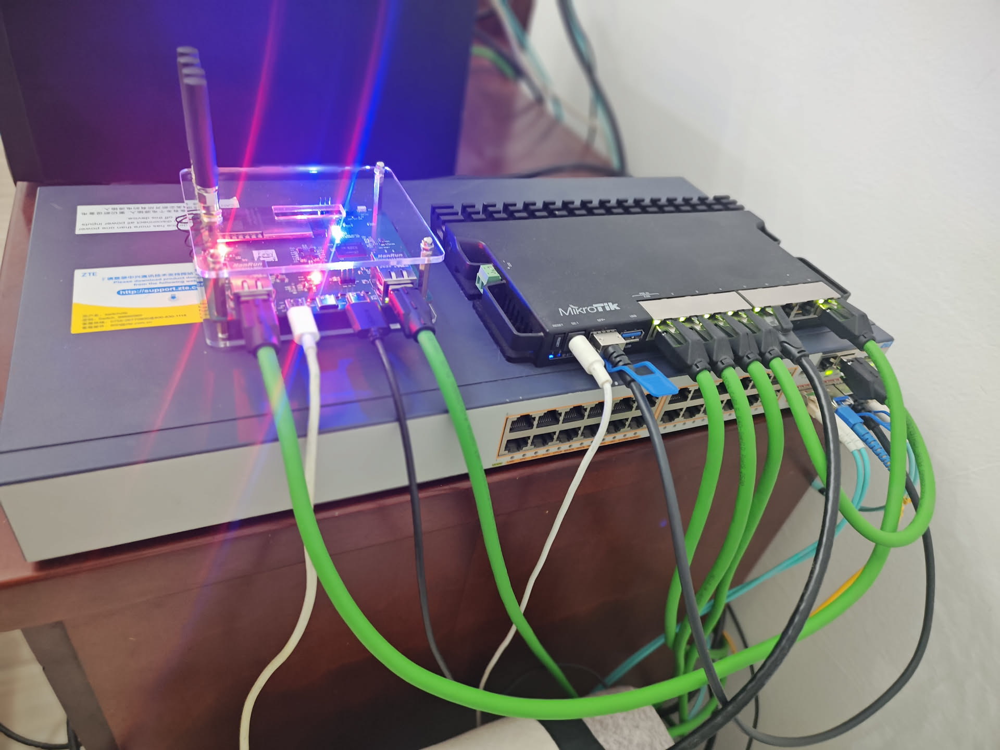
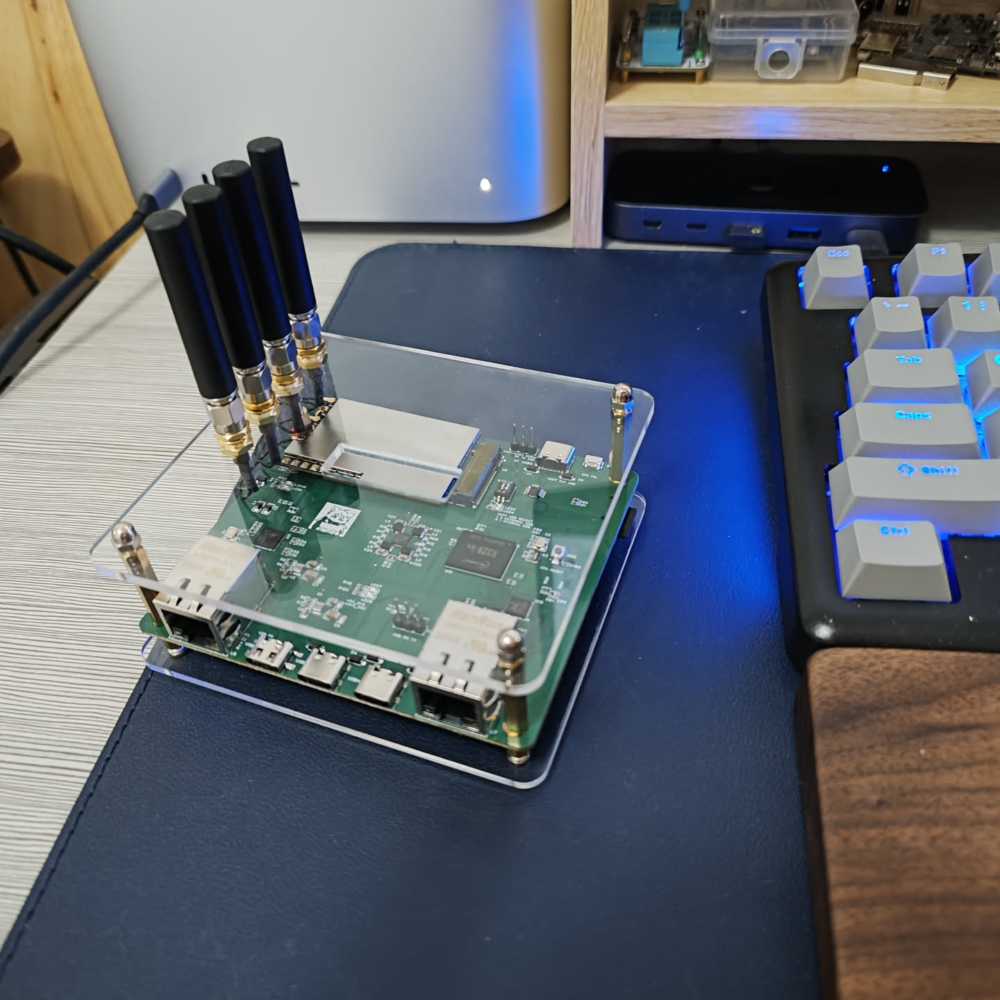

# 5G NGFF Module Carrier Board w/ Out-of-band Management

## Hardware Overview
This project is a hardware carrier board for 5G NGFF (M.2 Key-B) modules, integrating an Allwinner R329-N4 SoC and a Realtek RTL8125BG 2.5GbE network controller.

### Core Components
- **SoC**: Allwinner R329-N4 (Dual-core Cortex-A53, integrated 256MiB DDR3).
- **2.5G NIC**: Realtek RTL8125BG, connected to the 5G module's PCIe interface (requires module to operate in RC mode).
- **Management NIC**: Realtek RTL8211CG, connected to the R329-N4 SoC via RGMII, providing a dedicated 1GbE port.

### Out-of-band Management & Network Architecture
The onboard SoC enables Out-of-band management for the 5G module:
1. **Network Isolation**: The R329-N4 management system features an independent 1GbE port, allowing integration into dedicated management networks such as Homelab IPMI VLANs. This ensures logical and physical isolation from the 5G data traffic segment.
2. **Management Interface**: The R329-N4 communicates with the 5G module through an internal USB for AT command execution, dial-up control, firmware maintenance and accessing modules directly via ADB shell.
3. **External Interfaces**:
    - 1x 2.5GbE RJ45 port (5G module data plane).
    - 1x 1GbE RJ45 port (R329 management plane).
    - 1x USB System Debug UART (for R329).
    - 1x NGFF UART (for Module. Depending on the module definition, it may be either a module system serial port or a COEX Interface serial port).
    - 1x USB Host port (connected to R329).
    - 1x USB Device port (connected to Module, Switch between internal and external USB via DIP switch).

## Manufacturing
- **CAD Tool**: EasyEDA v3.2.80.
- **PCB Stackup**: 6-layer PCB, manufactured using the JLCPCB-3313 stackup process.
- **Impedance Matching**: Configured according to JLC-3313 parameters for USB (90Ω), PCIe differential pairs (100Ω), and RGMII bus signals.

## Gallery

## Bill of Materials
Refer to the file: `./Manufacture/BOM/NRMgmtCRB_v2_PCB1_20260129_230221_BOM.csv`
